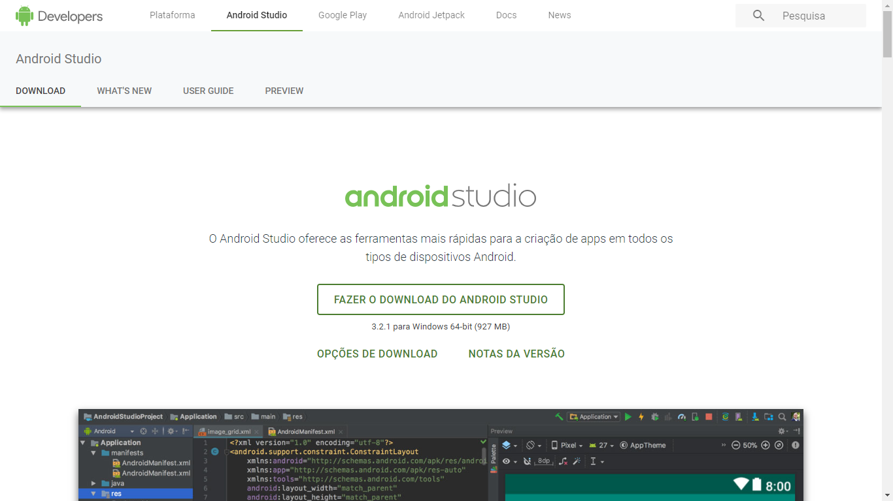

# Android Studio

#### Para instalar a IDE do Android, seguimos os seguites passos.

* Vamos até o site da IDE e fazemos o download

[Baixar aqui](https://developer.android.com/studio/?hl=pt-br)

* Baixe o instalador e execute, e deixe a instalação ser finalizada. 

* Quando a instalação terminar só precisa prosseguir e finalizar.

* Caso você já tenha instalado o Android Studio anteriormente e queira usar a mesma configuração selecione a primeira opção.

* Caso queira começar do zero selecione a segunda opção.

* O Android Studio irá inicializar fazer algumas atualizações e você verá a tela de bem-vindo!

* Apertar em proxímo

* Aqui vamos usar o padrão indicado pelo Android Studio

* Escolha a interface que mais te agradar e prossiga.

* Finalize a configuração básica do Android Studio

* Então agora é só agurdar enquanto os componentes necessários são instalados para nossa IDE, isso deve levar alguns minutos.

